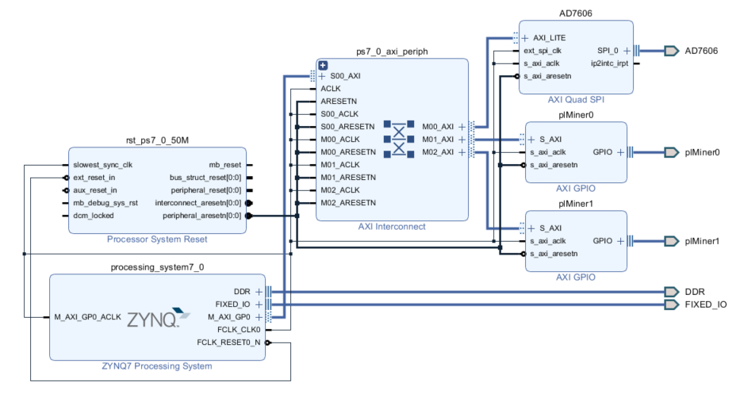
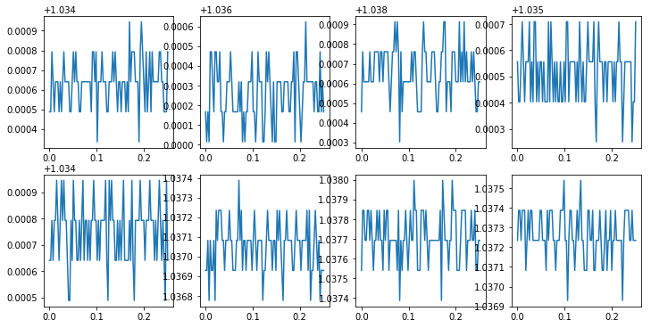

# how to use:  
copy ./AD7606PLSPI folder to ~/pynq/overlays/  
copy ./demo_AD7606_PLSPI folder tp ~/jupyter_notebooks/  
open your jupyter web console and run /demo_AD7606_PLSPI/AD7606_PL_SPI.ipynb  
# project detail:  
./s9PYNQ_AD7606.7z is the project folder  
using soft spi costs ~5000ms to read 800pcs 16bit data  
using axi quad spi ip core only costs ~250ms for the same amount of data  

    
	  
 

   
  
  

    
	  
 

   
  
  

    
	  
 

   
  
# references:  
[axi quad spi drivers for pynq](https://discuss.pynq.io/t/axi-spi-python-code/250/8)  
