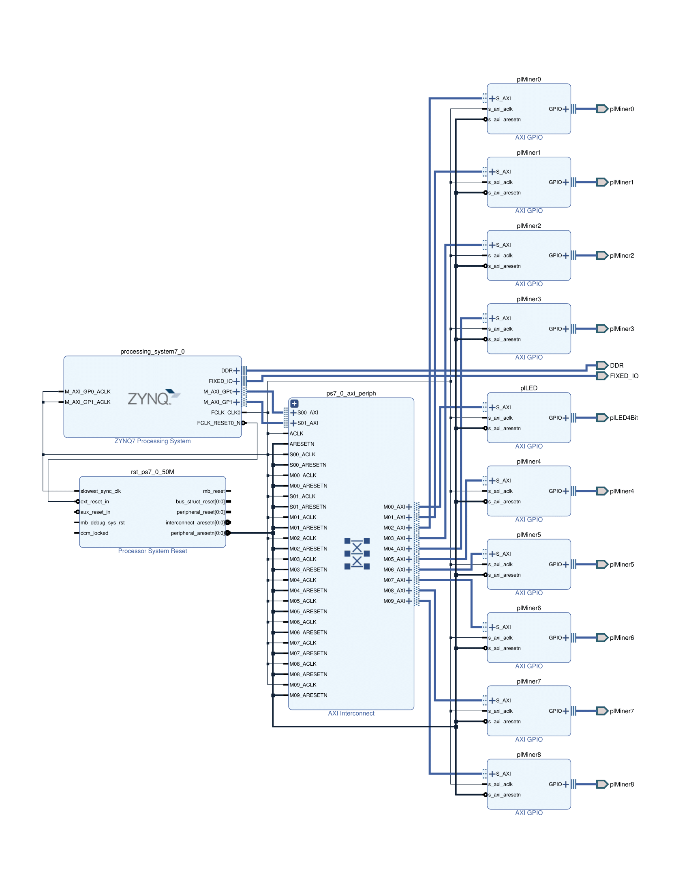

# how to use:  
copy ./antminerGPIO folder to ~/pynq/overlays/  
copy ./demo_gpio folder tp ~/jupyter_notebooks/  
open your jupyter web console and run /demo_gpio/s9_pynq_gpio.ipynb  
# project detail:  
./antminerGPIO.7z is the project folder  

    
	  
 

   
  
# references:  
[use gpio](https://github.com/Xilinx/PYNQ_Workshop/blob/master/Session_4/2_axi_gpio.ipynb)  
[add gpio](https://zhuanlan.zhihu.com/p/52469205)  
[axi gpio](https://medium.com/%E9%AB%94%E9%A9%97%E4%BA%BA%E7%94%9F-touch-life/pynq-z2-led-button-switch-gpio-test-45c2c270fd2f)
