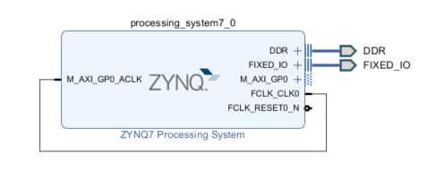

# how to use:  
copy ./base folder to ~/pynq/overlays/  
copy ./demo_base folder tp ~/jupyter_notebooks/  
open your jupyter web console and run /demo_base/overlay_download.ipynb  
# project detail:  
./base.7z is this project folder  

    
	  
 

   
  
#references:  
[base.bit and base.hwh](https://github.com/kangyuzhe666/zynq7010-pynq-2.5)
[overlay_download.ipynb](https://github.com/Xilinx/PYNQ)